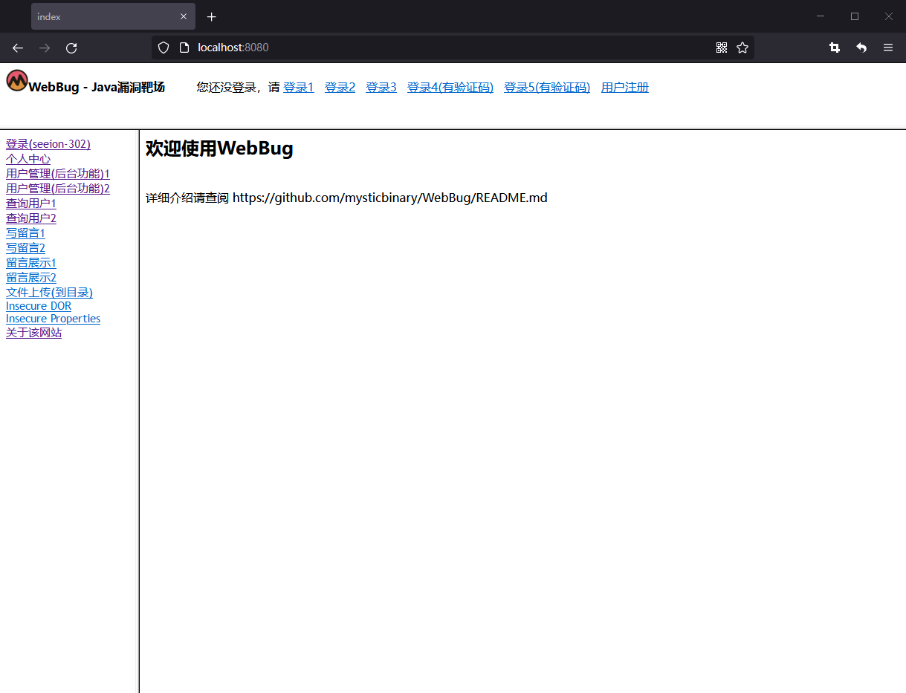

# WebBug靶场
> 包含如下漏洞，以及修复方案；

0. 暴力破解
1. 验证码绕过（前端绕过）
2. SQL注入（盲注）
3. 越权访问（垂直越权）
4. XSS（存储型）
5. XSS（反射型）
6. CSRF
7. 任意文件上传
8. 不安全的直接对象引用
9. 失效的身份认证和会话管理
10. 不安全的配置

# 警告
不要将此项目运行在外网服务器，除非你想被攻击。
本站点只做Web安全研究用。

# 运行效果图

# 技术选型
MVC架构

HTML+CSS+JavaScript+JSP

Java+Servlet+Fastjson+ESAPI

MySQL+JDBC

# 所需环境:
1. JDK 1.8
2. Tomcat 7.*
3. IDEA 直接使用open打开项目

# 更新日志：

**v.1.0.2**
1. 新添Session 会话缺陷漏洞；
2. 新添IDOR漏洞；
3. 新添SCRF漏洞；
4. 新添不安全的 Tomcat 错误页面配置；
5. 修复了/jsp/* 不可见文件路径

**v.1.0.1**

1. 更新README.md 描述文件；

**v.1.0.0**

1. 创建项目，提交第一个版本；